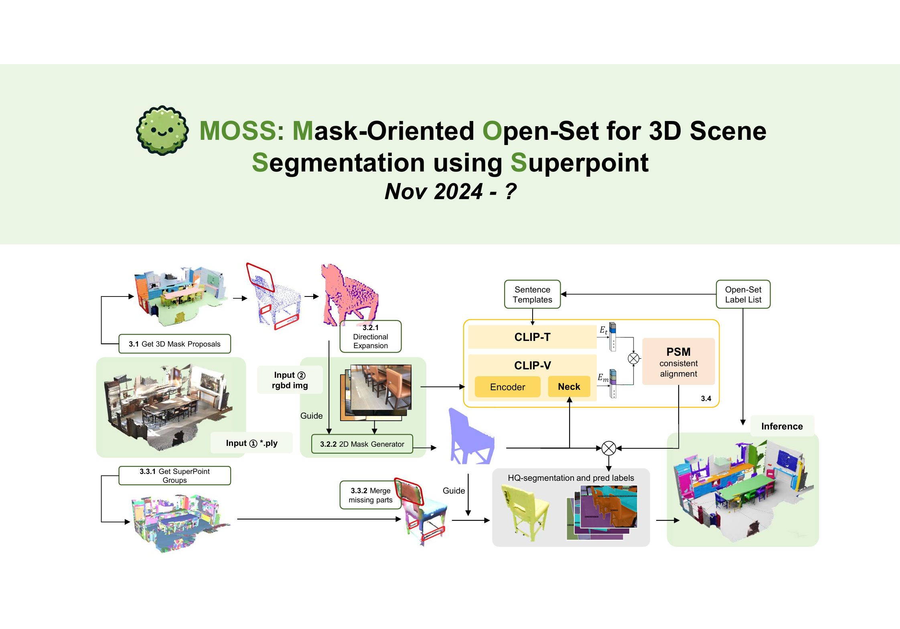
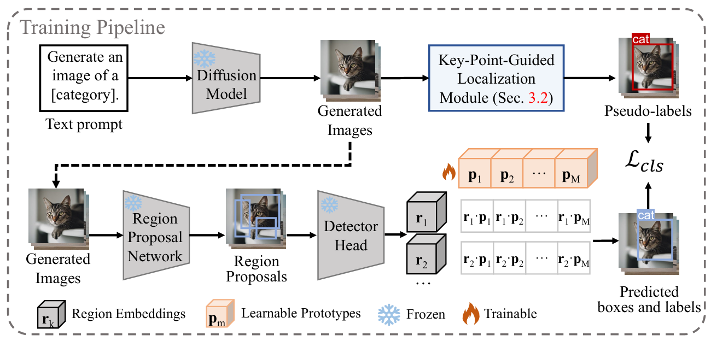

Hello! I am currently a master’s student at [Tongji University](https://en.tongji.edu.cn/p/). This is my personal homepage, where I will share some of my research projects and interesting side projects I’ve undertaken. I warmly invite you to reach out and engage in discussions with me!

<a href="/files/cv.pdf" class="cv-button" target="_blank"> 
  Here is my CV 📄
</a>

Research Interests
======
My recent research focuses primarily on **Open-Vocabulary Object Detection (OVD)**, encompassing both **2D OVD** and **3D Open-Vocabulary Instance Segmentation**. In the 2D domain, my collaborators and I utilized a diffusion model to generate sample images for novel categories. We proposed a keypoint localization module based on cross-attention maps to obtain bounding box labels for these sample images, subsequently training a set of prototypes using these box labels. In the 3D domain, we developed an open-set instance segmentation model based on multi-view sampling and distilled an MLP layer to map 3D features into CLIP’s shared embedding space. This enables direct instance classification by measuring the similarity between 3D features and textual features.

Moving forward, I plan to delve deeper into the field of **multimodal content understanding**.

Current Research
======

   

       

           <!--  -->
          
       

   

   

       <h3 style="margin-top: 0;">MOSS: Mask-Oriented Open-Set for 3D Scene Segmentation using Superpoint</h3>
       
<em>Preparing for NIPS 2025</em>

       

           <a href="../files/MOSS_v3.pdf">[PPT]</a>
           <a href="https://youtu.be/lukFo59tY5o">[Video]</a>
       

       

           The voiceover in the videos was created using ByteDance's Model <a href="https://www.doubao.com/">Doubao</a> that cloned my voice!
       

   

   

       

           <!--  -->
          
       

   

   

       <h3 style="margin-top: 0;"> ProDet:LearningPrototype-BasedRegion-WordAlignmentfor
 Open-VocabularyObjectDetection</h3>
       

           <a href="../files/ProDet.pdf">[PPT]</a>
       

       

           This paper has been submitted to ICCV 2025.
       

   

Achievements
======

  

    

      <label for="achievement1">Jianxing Scholarship Third Prize 2024</label>
    

  

  

    

      <label for="achievement2">Ningbo Future Star Scholarship First Prize 2024</label>
    

  

  

    

      <label for="achievement3">Tongji University Outstanding Student Scholarship Second Prize 2022&2020</label>
    

  

  

    

      <label for="achievement4">National Invention Patent: A Target Detection Method and System Based on an Improved DETR Algorithm 2024</label>
    

  

  

    

      <label for="achievement5">CCF CSP Computer Software Proficiency Certification Exam, ranked in the top 5% 2021</label>
    

  

